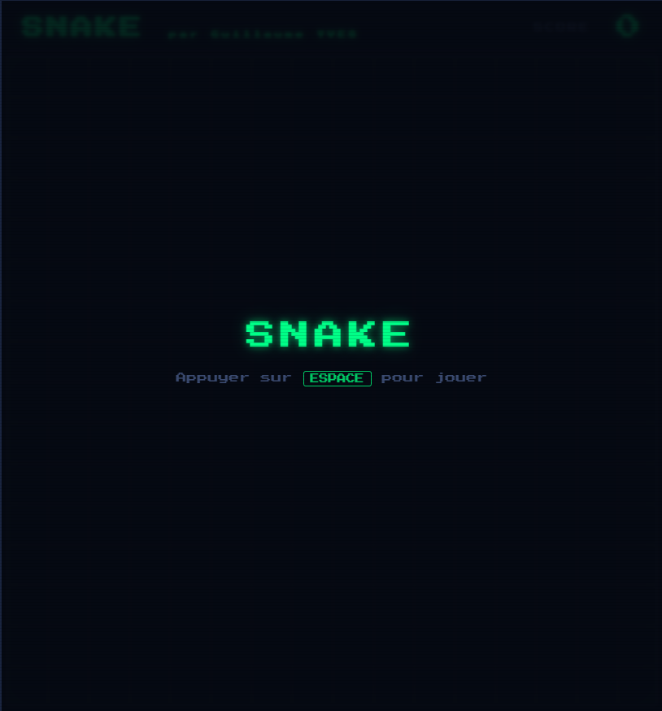

<div align="center">

# 🐍 NeuroSnake

**Snake classique + mode Auto IA par algorithme génétique**



[](https://developer.mozilla.org/fr/docs/Web/JavaScript)
[](https://sass-lang.com/)
[](#)

_Forké depuis [Snake-IT-DFS34A](https://github.com/tomDeprez/Snake-IT-DFS34A) de [@tomDeprez](https://github.com/tomDeprez) — refactorisé et étendu_

</div>

---

## Démo rapide

| Mode Manuel                  | Mode Auto IA                                          |
| ---------------------------- | ----------------------------------------------------- |
| Serpent contrôlé au clavier  | Jusqu'à 3 000 agents entraînés en parallèle           |
| Pommes classiques et dorées  | Réseau de neurones feedforward (JS pur)               |
| Multiplicateurs X2 / X3 / X5 | Algorithme génétique — sélection, crossover, mutation |
| Sons 8-bit Web Audio API     | 4 agents visibles + N simulés en arrière-plan         |

---

## Lancer le projet

### Via github pages :

> Depuis ce lien : [Neuro Snake](https://guillaumeyves.github.io/neuro-snake/game.html)

### En local (après git clone) :

```bash
npm install
# Ouvrir game.html dans un navigateur via un serveur local
```

> `npm run build:css` uniquement si vous modifiez le SCSS.

---

## Architecture

### Modules JS

| Fichier         | Rôle                                                 |
| --------------- | ---------------------------------------------------- |
| `config.js`     | Constantes globales (taille grille, vitesse, bonus…) |
| `state.js`      | État de la partie en cours                           |
| `dom.js`        | Références aux éléments HTML                         |
| `game.js`       | Boucle de jeu, start / pause / game over             |
| `snake.js`      | Déplacement et croissance du serpent                 |
| `apple.js`      | Spawn et collecte des pommes                         |
| `bonus.js`      | Pickups multiplicateurs                              |
| `collision.js`  | Détection murs et auto-collision                     |
| `score.js`      | Mise à jour du score et popups                       |
| `sound.js`      | Sons 8-bit via Web Audio API                         |
| `input.js`      | Clavier                                              |
| `overlay.js`    | Écrans de démarrage, pause, game over                |
| `responsive.js` | Scaling dynamique selon la taille de l'écran         |
| `main.js`       | Point d'entrée, branche mode manuel ↔ Auto IA        |

### Modules IA

| Fichier         | Rôle                                        |
| --------------- | ------------------------------------------- |
| `ai_game.js`    | Moteur de simulation autonome par agent     |
| `ai_agent.js`   | Un agent = 1 réseau de neurones + 1 moteur  |
| `ai_trainer.js` | Algorithme génétique, population, évolution |

---

## Mode Auto IA

### Réseau de neurones

Implémenté en **pur JavaScript**, sans librairie externe — fonctionnellement équivalent à brain.js.

```
13 entrées  →  16 neurones cachés  →  3 sorties
```

| Entrées (13)                 | Sorties (3)      |
| ---------------------------- | ---------------- |
| Radar distance obstacle (×3) | Tout droit       |
| Position relative pomme (×4) | Tourner à gauche |
| Pomme dorée ?                | Tourner à droite |
| Position relative bonus (×4) |                  |
| Temps restant bonus          |                  |

Activation **sigmoid** · Initialisation **He** (`√(2/fan_in)`)

### Algorithme génétique

Les poids évoluent par **sélection naturelle** plutôt que par rétropropagation — plus adapté ici car il n'existe pas de "bonne réponse" connue à l'avance, seulement une performance mesurable après coup.

```
Génération N
│
├── Trier agents par fitness (score × 1000 + ticks survie)
│
├── 1        élite      → copie exacte du champion
├── 40%      crossover  → mix de deux parents du top 10% + légère mutation
├── 40%      clones     → copies du top 5% avec mutation modérée
└── ~20%     aléatoire  → exploration / diversité génétique
```

### Performances headless

| Population | Ticks / frame RAF |
| ---------- | ----------------- |
| 100        | 80                |
| 500        | 40                |
| 1 000      | 20                |
| 2 000      | 12                |
| 3 000      | 8                 |

Les agents visibles tournent via `setInterval`. Les agents headless sont simulés en lot dans une boucle `requestAnimationFrame` — le navigateur reste réactif quelle que soit la population.

---

## SCSS

```bash
npm run build:css   # compile une fois
npm run watch:css   # recompile à chaque modification (dev)
```

`css/styles.css` est déjà compilé dans le repo — aucun build nécessaire pour jouer.
